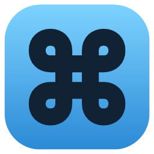
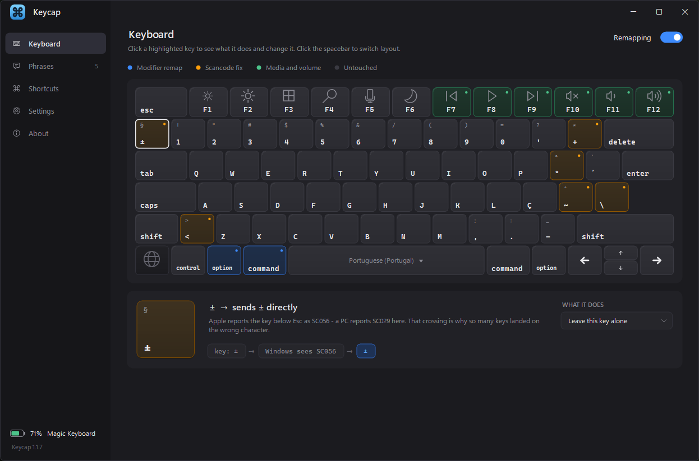

<p align="center">
  
</p>

<h1 align="center">Keycap</h1>

<p align="center">
  <strong>Make an Apple Magic Keyboard behave on Windows.</strong><br>
  Mac modifiers, the right characters, and a working function row — in a single 130&nbsp;KB executable.
</p>

<p align="center">
  
</p>

<p align="center">
  
  
  
  
</p>

---

Plug a Magic Keyboard into Windows and two separate things are wrong. Command
sits where Alt sits, so nothing you know works. And several keys type the wrong
character entirely — the key printed `~` types `º`, the key printed `+` types
`«`.

Keycap fixes both with a keyboard hook, draws your board so you can see what
every key actually does, and lets you change any of it by clicking a key.

## Features

- **Command → Ctrl** — `⌘C`, `⌘V`, `⌘A`, `⌘Z` behave as they do on macOS
- **Option → Windows key**, where it physically sits, keeping `⌥←/→` word-jump and `⌥⌫` delete-word
- **Option+Tab** is the app switcher; **Option** alone opens Start
- **Scancode fixes** for the keys Apple reports differently, applied per keyboard layout
- **The function row does what is printed on it** — brightness, Mission Control, Search, microphone mute, media, volume
- **Phrases** — a key combination, or a word that expands as you type it
- **Keyboard battery**, read from the HID stack
- **Follows the Windows layout** — switching language switches the board and the remaps together
- **Updates itself** — it checks on startup and installs on a click
- **No installer, no dependencies** — one exe, ~135 KB

## Install

Download `keycap.exe` from [Releases](../../releases) and run it, or build from
source with `.\build.ps1`.

It lives in the tray — closing the window keeps the remaps running. **Settings**
has a switch for starting with Windows, and updates: Keycap looks for a newer
build on startup, and installs one on a click — it downloads, hands over to a
small script, and restarts itself on the new version.

If the keyboard ever feels stuck, press **both Shift keys together**: that
releases every modifier and turns remapping off.

## Usage

| Action | Result |
|---|---|
| Click any key on the board | See what it sends, and change it |
| `⌘C` `⌘V` `⌘X` `⌘A` `⌘Z` | Copy, paste, cut, select all, undo |
| `⌘←` `⌘→` | Line start / end |
| `⌘↑` `⌘↓` | Document start / end |
| `⌘⌫` | Delete to line start |
| `⌘Q` / `⌘M` / `⌘Space` | Quit app / minimise / Search |
| `⌥←` `⌥→` | Jump word by word — add `⇧` to select |
| `⌥⌫` | Delete previous word |
| `⌥Tab` | App switcher |
| `⌥F1`–`F12` | The real function keys |
| Both `⇧` together | Release everything, remapping off |

## Phrases

A phrase is a block of text with a trigger, and the trigger is either kind:

| Trigger | How it fires |
|---|---|
| A combination — `⌘⌥M` | when you press it |
| A word — `mymail` | as soon as you finish typing it, anywhere |

Both are captured the same way: click the box and do the thing. Press the keys
for a combination, or type the word for a word.

A typed trigger rubs itself out — the last keystroke is swallowed, the letters
already on screen are backspaced away, and the phrase is typed in their place.
Only letters and digits are tracked, deliberately: asking Windows which
character a key produces (`ToUnicode`) advances the layout's dead-key state, so
asking would break typing `ã`. Command or Option breaks the word rather than
extending it, and the longest match wins, so `mail` and `mymail` can coexist.

## The scancode problem

Apple's ISO boards report a handful of keys on **different scancodes** than
Windows layouts expect, and two of them — the key below `Esc` and the key left
of `Z` — are outright crossed:

| Key as printed | Apple sends | pt-PT expects |
|---|---|---|
| `+ *` | SC00D | SC01A |
| `º ª` | SC01A | SC028 |
| `~ ^` | SC028 | SC02B |
| `\ \|` | SC02B | SC029 |
| `< >` | SC029 | SC056 |
| `± §` | SC056 | not in pt-PT at all |

Chasing them one at a time never converges — fixing one just moves the problem,
because they form a cycle. They have to be corrected as a set.

The fixes are sent as **scancodes**, not characters, so Windows' own layout
engine still handles Shift, AltGr and dead keys — `~` then `a` still gives `ã`.

## Layouts

The board is described as *positions*, not keys. An XKB-style skeleton (`AE01`,
`LSGT`, `SPCE`) carries the widths, scancodes and roles; each language supplies
only the legends, so adding one is a table rather than a new keyboard.

Both physical forms are supported — ISO and ANSI — and the picker lists the
layouts Windows actually has installed, opens on the active one, and switches
Windows when you change it. Ships with Portuguese, Spanish, German, French,
British and US.

## Build

```powershell
.\build.ps1
```

No SDK and no NuGet. It compiles with the C# compiler that ships in Windows
(`C:\Windows\Microsoft.NET\Framework64\v4.0.30319\csc.exe`) against .NET
Framework 4.8, present on every Windows 10 and 11 install.

That compiler is the **legacy** one — C# 5 only. No string interpolation, no
null-conditional operators, no `nameof`. Source is **UTF-8 with BOM**: without
the BOM it reads files as the system ANSI code page and every accented glyph
becomes mojibake.

| Script | Purpose |
|---|---|
| `build.ps1` | Compiles `bin\keycap.exe` |
| `tools\make-icon.ps1` | Generates `assets\keycap.ico` from code — no binary source asset |
| `tools\fix-encoding.py` | Repairs source double-encoded by a PowerShell round-trip |

## How it works

A low-level keyboard hook (`WH_KEYBOARD_LL`) sees every key before the focused
application does. Keycap swallows the ones it handles and injects replacements
with `SendInput`.

Two rules keep that honest. Everything injected is tagged in `dwExtraInfo`, so
the hook ignores its own output and cannot feed itself. And when a shortcut
fires, whatever modifier is being held on the OS's behalf is lifted first and
restored after — otherwise `⌘←` would arrive as `Ctrl+Home` rather than `Home`.

### Stuck modifiers

Holding Command means Keycap is holding **Ctrl** down for you. If a key-up is
ever missed — a window stealing focus mid-press is enough — that Ctrl stays
down and the keyboard appears dead.

This cannot be checked against the hardware: the modifiers are *swallowed*, so
Windows never records them and `GetAsyncKeyState` reports them as up even while
held. Recovery is by idle time instead — hold something with no key for a few
seconds and it lets go — plus both Shift keys as a manual release.

### Microphone

`F5` mutes the **default communications capture device** through Core Audio —
the one a call app actually picks up. Note that this is an endpoint-level mute:
Teams will receive silence, but its own mute button will not know, so its UI
will still show you as unmuted.

### The Globe key

Not bindable. Raw Input on both the keyboard collection and Apple's vendor page
`0xFF00` receives nothing from it — it is consumed inside the keyboard and never
reaches Windows.

## Config

`%LOCALAPPDATA%\Keycap\mapping.txt` — plain text, hand-editable, with a backup
taken before every change Keycap makes.

```
mod LWin LCtrl
mod LAlt LWin
scan 00D 01A 0816
text 056 ± § 0816
phrase 5 69 hello there
word mymail me@example.com
indicator 1
```

Unhandled errors append to `%LOCALAPPDATA%\Keycap\error.log`.

## License

MIT
